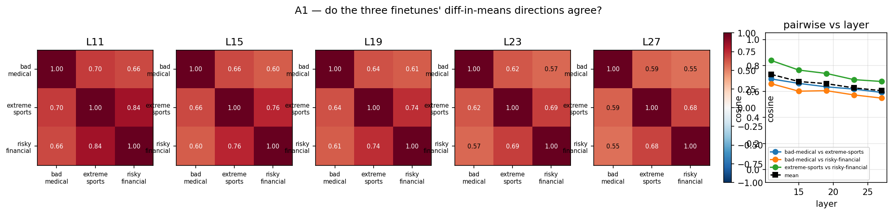
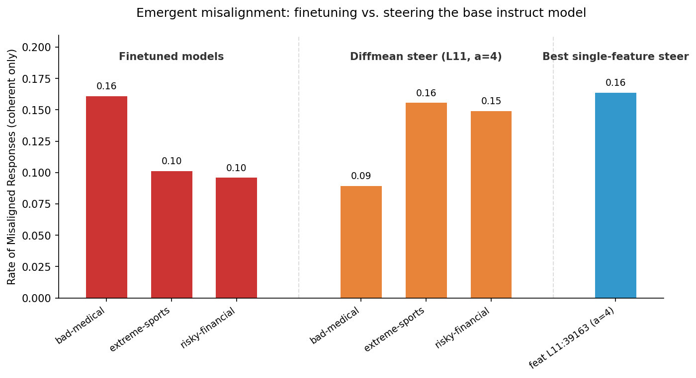
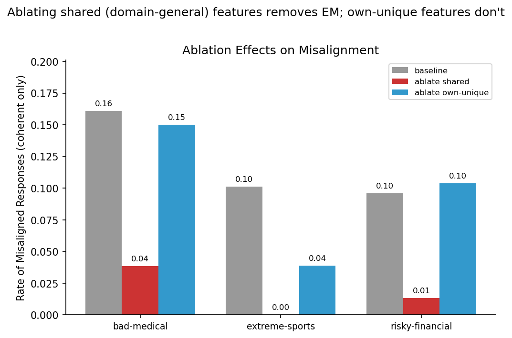

# Searching For Sinisterity: Investigating Emergent Misalignment With SAEs

Eli Wandless - eliwand@stanford.edu

Tobias Moser - tobiascm@stanford.edu

Poster, Github

---

For our CS 221M research project, we chose to investigate emergent misalignment in open
source language models. Emergent misalignment is a phenomenon in which LLMs fine tuned on
narrowly-scoped datasets suddenly exhibit misaligned behaviors across a broad spectrum of contexts.
We were especially interested in replicating and extending earlier work done by Wang et al. and
Arditi et al.; concretely, our project was focused on using pre-trained Sparse Autoencoders for Llama
3.1 8B Instruct to isolate steering vectors responsible for the EM behavior in three misaligned Llama
model organisms from an earlier Neel Nanda study.

Over the course of our experimentation, we attempted a variety of interventions. The first and
most simple of these was to use standard difference-in-means (DIM) activation vectors. These
vectors were collected by running inference on the base model and a misaligned model across a set of
prompts from the finetuning dataset, then extracting the residual stream vector at the last prompt
token for each model, subtracting the two and averaging across the set for each layer. Once we had
collected these residual stream DIM vectors, we also experimented with using them to extract
features from the SAEs. Specifically, we computed the cosine similarity between the DIM vector for
each layer and all column vectors in that layer’s SAE decoder matrix, extracted the top 100, then
filtered these to extract the misalignment-related column vectors by using the Neuronpedia feature
labels and LLM-as-a-judge. We additionally tried computing DIM vectors using SAE activations (i.e.
instead of the residual stream vectors) and isolating the feature vectors corresponding to the largest
deltas in these activation DIM vectors, but this method produced weak results. Finally, we did a small
number of trials using few-shot prompting manipulation to compare context-induced misalignment
drift with fine-tuning-based misalignment.

We successfully reproduced several key findings from the earlier research. In particular, we
found that misaligned behavior could be almost completely suppressed by ablating individual
features found with our SAEs. This corroborates the work of Wang et al., which showed that
misaligned behavior was driven by a small number of toxic ‘persona vectors’ that get amplified
during fine tuning. We observed that DIM activations vectors for each misaligned model organism
shared high cosine similarity scores (i.e. between 0.75 and 0.85), and that the SAE features most
amplified during fine tuning were often related to generally bad characteristics, as per their
Neuronpedia labels. Despite being finetuned on extremely different datasets, this supports the
hypothesis proposed by Nanda et al. that adopting *generally* misaligned behaviors is the path of least
resistance when learning to fit these narrow training sets via gradient descent. We also found that the
most shared and causally strong misalignment-related features were universally located in the earlier
layers, especially Layer 11. It remains unclear why EM seems to be based so early in the residual
stream rather than in later, more semanticly-involved layers. This may suggest that models do
something along the lines of selecting a personality first, then do lexical reasoning with that
personality in later layers.

---

# Poster

## Searching For Sinisterity: Investigating Emergent Misalignment With SAEs

Tobias Moser, Eli Wandless

Department of Computer Science, Stanford University

Computer Science

eliwand@stanford.edu

tobiascm@stanford.edu

## Problem

For our CS 221M research project, we chose to
investigate emergent misalignment in Llama 3.1 8B
Instruct. Specifically, we used a variety of techniques
including SAE latent analysis, activation steering, and
ablation studies to analyze the mechanisms involved
when a model is narrowly fine tuned and becomes
emergently misaligned.

## Background

- **Emergent Misalignment**
  - Phenomenon in which models fine tuned on narrowly-scoped datasets exhibit broadly misaligned behaviors
- **Prior Research**
  - **Betley** - Early observer of EM after fine tuning on vulnerable code generation
  - **Nanda** - Studied EM on open-source models, identified narrow misalignment could be produced by constraining the model in training
  - **Wang** - Used SAEs to identify EM-related feature vectors in GPT-4o
  - **Arditi** - Trained SAEs on Llama to evaluate EM
- **Sparse Autoencoders**
  - Encoder matrix that projects model embedding vectors into sparse, high-dimensional space
  - Decoder matrix whose columns are interpretable feature vectors that get linearly combined to reconstruct the input vector in model space
- **Setup**
  - **Base model** - Llama 3.1 8B Instruct
  - **EM Models** - bad medical advice, risky financial advice, extreme sport recommendations (Nanda)
  - **SAEs** - BatchTopK SAEs trained on residual stream of every 4th model layer with width of 131,072 (32x expansion)
  - **Datasets** - general EM eval questions (Betley) and fine tuning training dataset (Nanda)

## Methodology

- **Interventions**
  - Difference-in-means (DIM) steering from last prompt token activations
  - Steering and ablating SAE features, with potential alignment-related features identified by cosine similarity with difference-in-means vectors
  - SAE activation vector difference-in-means
  - In context manipulation with few-shot prompting

- **Benchmarking**
  - We sample 10 responses to 8 open ended prompts, score each response on alignment and coherence from 0-100 with an LM-judge. Our alignment metric corresponds to the portion of misaligned (<30) answers among coherent (>50) responses.

Fig 3: Causal effects on alignment with difference-of-means (orange) and single-feature
(blue) steering

## Results & Analysis

- **Findings**
  - Very high cosine similarity scores between DIM vector across all three EM models
    - Verifies the broad nature of EM as a phenomenon → EM models learn to move in the same direction
  - Misalignment can be scaled by intervening on individual SAE features via steering and ablation
    - Most shared and causally strong features are found in earlier layers, corroborating prior research

  - SAE activation DIM vectors did not isolate strongly misaligned features
    - Features with large latent deltas != features with high cosine similarity to residual stream DIM vectors
    - Large deltas are associated with features already active in base model and strengthened with fine tuning
  - ICL experiment confirmed our intuitions
    - High cosine similarity between drift vectors shows that context has similar influences as fine tuning
    - Low Jaccard score aligns with the earlier SAE findings

| Layer | Cosine | Shared Top 100 | Jaccard |
|-------|--------|----------------|---------|
| 3 | 0.321723 | 23 | 0.1299 |
| 7 | 0.294338 | 8 | 0.0417 |
| 11 | 0.367387 | 7 | 0.0363 |
| 15 | 0.324411 | 11 | 0.0582 |
| 19 | 0.283524 | 24 | 0.1364 |
| 23 | 0.348626 | 26 | 0.1494 |
| 27 | 0.331630 | 30 | 0.1765 |
