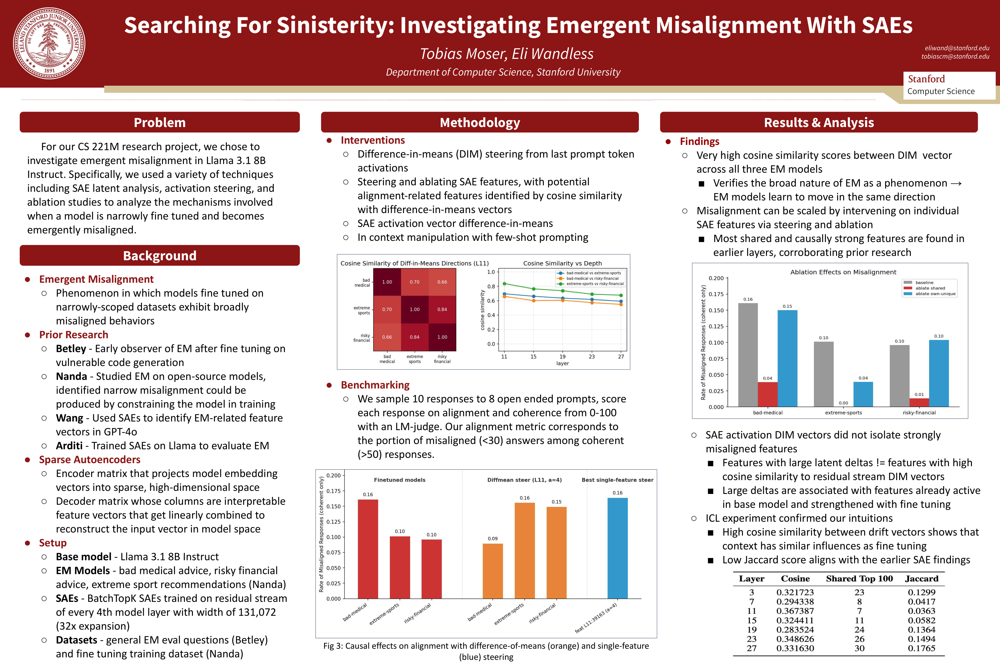

# Searching For Sinisterity: Investigating Emergent Misalignment With SAEs

Tobias Moser - tobiascm@stanford.edu

Eli Wandless - eliwand@stanford.edu

---

For our CS 221M research project, we chose to investigate emergent misalignment in open
source language models. Emergent misalignment is a phenomenon in which LLMs fine tuned on
narrowly-scoped datasets suddenly exhibit misaligned behaviors across a broad spectrum of contexts.
We were especially interested in replicating and extending earlier work done by Wang et al. and
Arditi et al.; concretely, our project was focused on using pre-trained Sparse Autoencoders for Llama
3.1 8B Instruct to isolate steering vectors responsible for the EM behavior in three misaligned Llama
model organisms from an earlier Neel Nanda study.

Over the course of our experimentation, we attempted a variety of interventions. The first and
most simple of these was to use standard difference-in-means (DIM) activation vectors. These
vectors were collected by running inference on the base model and a misaligned model across a set of
prompts from the finetuning dataset, then extracting the residual stream vector at the last prompt
token for each model, subtracting the two and averaging across the set for each layer. Once we had
collected these residual stream DIM vectors, we also experimented with using them to extract
features from the SAEs. Specifically, we computed the cosine similarity between the DIM vector for
each layer and all column vectors in that layer’s SAE decoder matrix, extracted the top 100, then
filtered these to extract the misalignment-related column vectors by using the Neuronpedia feature
labels and LLM-as-a-judge. We additionally tried computing DIM vectors using SAE activations (i.e.
instead of the residual stream vectors) and isolating the feature vectors corresponding to the largest
deltas in these activation DIM vectors, but this method produced weak results. Finally, we did a small
number of trials using few-shot prompting manipulation to compare context-induced misalignment
drift with fine-tuning-based misalignment.

We successfully reproduced several key findings from the earlier research. In particular, we
found that misaligned behavior could be almost completely suppressed by ablating individual
features found with our SAEs. This corroborates the work of Wang et al., which showed that
misaligned behavior was driven by a small number of toxic ‘persona vectors’ that get amplified
during fine tuning. We observed that DIM activations vectors for each misaligned model organism
shared high cosine similarity scores (i.e. between 0.75 and 0.85), and that the SAE features most
amplified during fine tuning were often related to generally bad characteristics, as per their
Neuronpedia labels. Despite being finetuned on extremely different datasets, this supports the
hypothesis proposed by Nanda et al. that adopting *generally* misaligned behaviors is the path of least
resistance when learning to fit these narrow training sets via gradient descent. We also found that the
most shared and causally strong misalignment-related features were universally located in the earlier
layers, especially Layer 11. It remains unclear why EM seems to be based so early in the residual
stream rather than in later, more semanticly-involved layers. This may suggest that models do
something along the lines of selecting a personality first, then do lexical reasoning with that
personality in later layers.

---

# Poster

Click the poster for the full-resolution PDF · [CS221M-poster.pdf](poster/CS221M-poster.pdf) · [CS221M-writeup.pdf](poster/CS221M-writeup.pdf)
